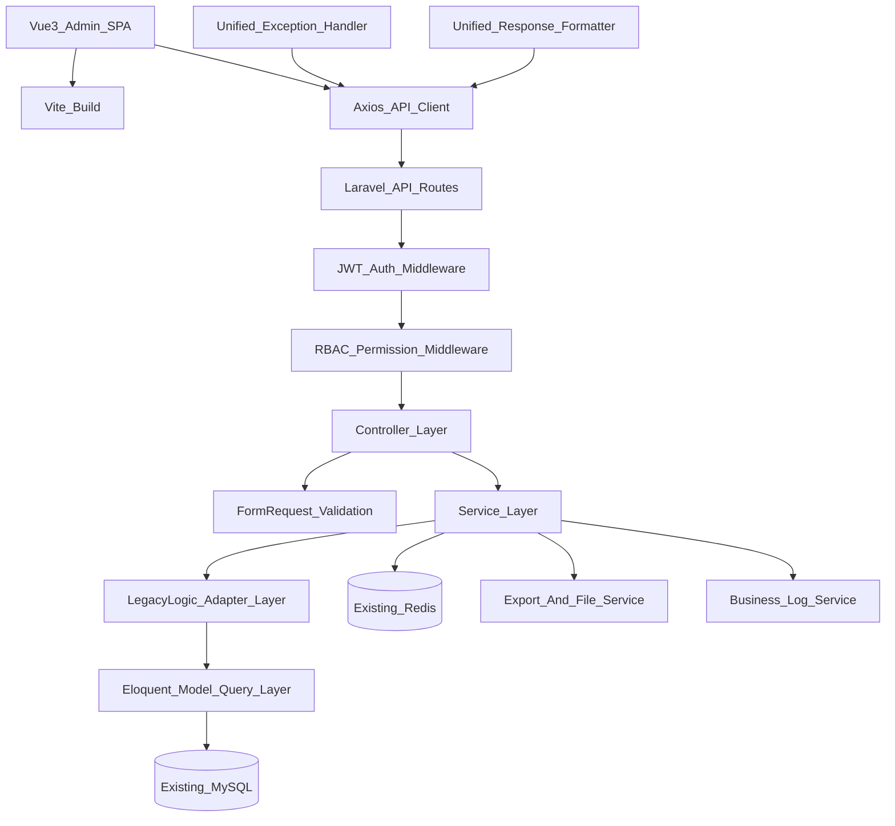

# Admin 后台 Laravel + Vue3 重构架构方案

## 依据与边界

本方案基于已摸底的旧后台关键文件：

- `/Users/ligang/code/ai/jiaowei-daxing/admin/init.php`：旧页面入口，解析 `module/action.php` 并定义 `CONTROL`、`ACTION`。
- `/Users/ligang/code/ai/jiaowei-daxing/admin/rest.php`：旧 AJAX 入口，使用 `do=module.action` 映射到 `admin/{module}/ajax.php` 的同名方法。
- `/Users/ligang/code/ai/jiaowei-daxing/admin/inc/function.php`：旧权限、路由、统一响应、日志、工具函数集中处。
- `/Users/ligang/code/ai/jiaowei-daxing/admin/inc/class/Session.class.php`：旧 session 登录态。
- `/Users/ligang/code/ai/jiaowei-daxing/admin/main.php` 与 `/Users/ligang/code/ai/jiaowei-daxing/admin/templates/main.html`：旧后台菜单、iframe Tab、Smarty 主壳。
- `/Users/ligang/code/ai/jiaowei-daxing/.omc/plans/admin-subsystem-business-whitepaper.md`：旧 admin 子系统业务白皮书。

硬性边界：

- 不改变任何业务规则、判断条件、状态流转、数据计算口径、列表字段、筛选条件、提示文案、导出内容。
- 不用 Laravel 的默认业务语义重写旧流程，只将旧 PHP 逻辑迁移到可测试、可维护的分层结构。
- 所有旧 Smarty 输出页面改为 JSON API；Vue3 只负责渲染和交互复刻。
- 旧接口中的 `status=200`、`40098` 无权限、`40099` action 不存在、各模块 `40001+` 业务码必须保留语义。

## 1. 整体架构图文字版



分层说明：

- Vue3 Admin SPA 替代 `main.html` 的 iframe Tab 主壳，但保留多 Tab、菜单、弹窗、刷新父列表等用户感知行为。
- Laravel API 替代 `rest.php?do=module.action` 和所有页面 PHP 文件。
- Controller 只接收请求、调用 Request、调用 Service、返回统一 JSON，不写 SQL、不写业务判断。
- FormRequest 只承接旧前端和旧 PHP 的参数校验规则，不新增业务限制。
- Service 负责业务用例编排，保持旧流程顺序。
- Logic 层作为旧系统复杂算法和跨表判断的迁移承接层，优先逐函数平移旧逻辑，后续再补测试，不做业务优化。
- Model 层负责表映射、关联声明、基础查询封装；复杂 SQL 可先保留 Query Builder，避免迁移时误改口径。
- Response 与 Exception 统一把 Laravel 异常、验证错误、权限错误映射为旧系统可识别的 `code/msg/data` 结构。

建议技术版本：

- 后端：PHP 8.4、Laravel 当前最新稳定主版本。
- 前端：Vue 3、Vite、Element Plus 当前最新稳定版，采用 `<script setup>` 与 Composition API。
- 权限：JWT 登录态 + RBAC 权限码，权限码保持旧 `module.action` 体系。
- 数据库：优先沿用旧库旧表，迁移阶段只做 Laravel migration 基线描述，不改字段含义。

## 2. 后端目录结构标准

建议新后端目录：

```text
backend/
  app/
    Http/
      Controllers/
        Api/
          Admin/
            AuthController.php
            DashboardController.php
            GoodsController.php
            OrderController.php
            SupplierController.php
            SchoolController.php
            SchoolCanteenController.php
            BackorderController.php
            ReceivableController.php
            BiddingController.php
            CategoryController.php
            UserController.php
            RoleController.php
            PermissionController.php
            MenuController.php
            StatController.php
            ApproveController.php
            JiagewangController.php
            ComplaintController.php
            EmergencyController.php
            GroupController.php
            DepartmentController.php
            PostController.php
      Middleware/
        JwtAuthenticate.php
        CheckAdminPermission.php
        ForceJsonResponse.php
      Requests/
        Admin/
          Auth/
          Goods/
          Order/
          Supplier/
          School/
          SchoolCanteen/
          Receivable/
          Backorder/
          Bidding/
          Category/
          User/
          Rbac/
    Services/
      Admin/
        AuthService.php
        MenuService.php
        RbacService.php
        GoodsService.php
        OrderService.php
        SupplierService.php
        SchoolService.php
        SchoolCanteenService.php
        ReceivableService.php
        BackorderService.php
        BiddingService.php
        CategoryService.php
        StatService.php
        ApproveService.php
        JiagewangService.php
        ComplaintService.php
        EmergencyService.php
        GroupService.php
        ExportService.php
        UploadService.php
        BusinessLogService.php
    Logic/
      Admin/
        Legacy/
          GoodsLegacyLogic.php
          OrderLegacyLogic.php
          ReceiptLegacyLogic.php
          SupplierApiLegacyLogic.php
        Rules/
          OrderStatusLogic.php
          GoodsStatusLogic.php
          PriceLimitLogic.php
          ApprovalFlowLogic.php
    Models/
      AdminUser.php
      SsoUser.php
      SystemMenu.php
      Post.php
      Department.php
      Goods.php
      GoodsCategory.php
      Supplier.php
      School.php
      SchoolCanteen.php
      Order.php
      OrderGoods.php
      Backorder.php
      Receivable.php
      Bidding.php
      SystemLog.php
    Support/
      ApiResponse.php
      LegacyStatus.php
      LegacyDictionary.php
      LegacyPermission.php
      LegacyRouteMap.php
      Money.php
      Sm3Signer.php
  bootstrap/
    app.php
  config/
    admin.php
    jwt.php
    legacy.php
  database/
    migrations/
      baseline_existing_schema.php
    seeders/
      RbacBaselineSeeder.php
  routes/
    api.php
    admin_api.php
```

目录职责：

- `Controllers/Api/Admin`：每个旧模块一个 Controller，方法名按新 REST 语义组织，但必须在 `LegacyRouteMap` 中维护旧 `do=module.action` 对照。
- `Requests/Admin`：每个新增、编辑、审核、导入、导出动作一个 Request。字段名默认沿用旧表单字段名。
- `Services/Admin`：承接完整业务用例，如商品上架、订单审核、供应商折扣导入、学校账号管理。
- `Logic/Admin/Legacy`：承接旧系统已有复杂逻辑类，如旧 `admin/logic/OrdersLogic.php`、`admin/logic/ReceiptLogic.php`。
- `Logic/Admin/Rules`：承接状态判断、金额计算、审批流、价格限高等纯业务规则。
- `Models`：一表一模型，默认不改变表名、主键、时间字段含义。
- `Support/ApiResponse.php`：统一输出 `{code,msg,data}`，同时提供旧字段兼容策略。
- `Support/LegacyStatus.php`：集中维护旧 `status` 业务码到新 `code` 的映射。
- `Support/LegacyDictionary.php`：集中维护旧 `$dictionary` 枚举中文文案，防止前后端文案漂移。
- `Support/LegacyPermission.php`：维护旧 `CONTROL.ACTION` 权限码和新路由权限的映射。

后端调用规范：

```text
Route -> Middleware -> Controller -> FormRequest -> Service -> Logic -> Model/DB -> ApiResponse
```

禁止事项：

- Controller 中禁止直接写 SQL。
- Request 中禁止做跨表业务判断。
- Model 中禁止写完整业务流程。
- Service 中禁止私自改变旧系统判断顺序。
- Vue 前端禁止绕过权限接口自行推断菜单。

## 3. 前端目录结构标准

建议新前端目录：

```text
frontend/
  src/
    main.ts
    App.vue
    api/
      http.ts
      modules/
        auth.ts
        menu.ts
        goods.ts
        order.ts
        supplier.ts
        school.ts
        schoolCanteen.ts
        receivable.ts
        backorder.ts
        bidding.ts
        category.ts
        user.ts
        rbac.ts
        stat.ts
        approve.ts
        jiagewang.ts
        complaint.ts
        emergency.ts
        group.ts
    router/
      index.ts
      guards.ts
      legacyRouteMap.ts
    stores/
      auth.ts
      menu.ts
      tabs.ts
      dictionary.ts
      permission.ts
    layouts/
      AdminLayout.vue
      components/
        SidebarMenu.vue
        Topbar.vue
        TabBar.vue
        Breadcrumb.vue
    views/
      dashboard/
      goods/
      order/
      supplier/
      school/
      school-canteen/
      receivable/
      backorder/
      bidding/
      category/
      user/
      rbac/
      stat/
      approve/
      jiagewang/
      complaint/
      emergency/
      group/
      system-log/
    components/
      common/
        SearchForm.vue
        DataTable.vue
        TableToolbar.vue
        StatusTag.vue
        PermissionButton.vue
        ConfirmAction.vue
        LegacyDialog.vue
        ExportButton.vue
        UploadDialog.vue
        DictSelect.vue
        DateRangePicker.vue
      business/
        goods/
        order/
        supplier/
        school/
    composables/
      useLegacyList.ts
      useLegacyForm.ts
      usePermission.ts
      useDictionary.ts
      useExport.ts
      useDialogRefresh.ts
    utils/
      legacyResponse.ts
      legacyMessage.ts
      validators.ts
      formatters.ts
      download.ts
      money.ts
    styles/
      index.scss
      admin-theme.scss
      legacy-compatible.scss
```

前端架构原则：

- `AdminLayout.vue` 替代旧 `main.html`，实现左侧菜单、顶部用户信息、修改密码、退出、多 Tab。
- `router/legacyRouteMap.ts` 维护旧 `module/action.php` 到新 Vue route 的映射。
- `stores/menu.ts` 使用后端菜单接口生成菜单，不在前端硬编码业务菜单。
- `stores/permission.ts` 保存旧权限码，如 `goods.index`、`order.audit`，供 `v-permission` 和按钮组件判断。
- `SearchForm.vue` 复刻旧列表页筛选区，查询字段名保持旧 GET/POST 字段名。
- `DataTable.vue` 复刻旧 Smarty 表格布局，使用服务端分页，保留总条数、统计行、操作列。
- `LegacyDialog.vue` 把旧 `layer.open type:2` 的 iframe 弹窗改为 `ElDialog` 或 `ElDrawer`，保留成功后关闭和刷新来源列表的行为。
- `legacyMessage.ts` 把旧 `layer.msg` 的成功 2 秒、失败 3 秒、确认框按钮文案映射为 Element Plus 行为。

## 4. 全局统一规范

### API 响应规范

新系统统一返回：

```json
{
  "code": 200,
  "msg": "Success",
  "data": {}
}
```

兼容旧系统策略：

- 后端内部统一使用 `code/msg/data`。
- 前端 `legacyResponse.ts` 同时兼容旧 `status/message/data`，迁移期间可识别旧格式。
- 对外 admin 新 API 默认只返回 `code/msg/data`。
- 业务码必须与旧 `status` 一致：旧 `status=200` 对应新 `code=200`，旧 `40098` 仍为新 `code=40098`。
- 若旧接口把提示文案放在 `data` 字符串中，新接口迁移时 `msg` 使用同样文案，`data` 可返回业务数据；涉及旧提示复刻的前端以 `msg || data` 取文案。

建议响应封装：

```php
ApiResponse::success($data = [], string $msg = 'Success', int $code = 200);
ApiResponse::fail(string $msg, int $code = 40001, mixed $data = null);
ApiResponse::legacy(string $message, int $status = 200, mixed $data = null);
```

### 异常规范

- `ValidationException`：返回 `code=40001`，`msg` 使用第一个校验错误文案，不改变旧表单提示。
- `AuthenticationException`：返回 `code=40100`，`msg=请先登录`。
- `AuthorizationException` 或权限中间件失败：返回 `code=40098`，`msg=对不起，您没有操作权限！`。
- `ModelNotFoundException`：返回旧模块原有的“记录不存在”文案和对应业务码。
- 未捕获异常：生产环境返回 `code=50000`，`msg=系统繁忙，请稍后再试`，日志记录完整上下文。
- Laravel 异常渲染必须强制 admin API 返回 JSON，不能返回 HTML 错误页。

### 参数校验规范

- 所有新增、编辑、审核、状态切换、导入、导出接口必须创建 FormRequest。
- 校验规则从旧模板手写 JS 和旧 `ajax.php` 参数判断迁移，不新增限制。
- Request 的字段名保持旧字段名，如 `id`、`status`、`name`、`mobile`、`start_time`、`end_time`。
- 前端 Element Plus rules 与后端 FormRequest 文案保持一致。
- 旧系统允许空值、默认值、`intval` 后为 0 的行为必须逐项保留。

### 权限规范

- RBAC 基础数据沿用旧表：`sso_user`、`user`、`post`、`system_menu`。
- 用户登录后根据旧 `user.post` 找 `post.privilege`，再查 `system_menu.path` 生成权限码数组。
- 菜单生成规则保持旧逻辑：一级菜单取 `system_menu.level=1,status=1`，二级菜单取 `pid,status,sort`，再按用户权限过滤。
- 按钮权限使用旧 `path`，即 `module.action`。
- 状态为 `status=0` 的旧免授权菜单或系统权限必须保留原语义，不可简单丢弃。

### 日志规范

- 保留旧 `system_log` 写入语义：`module`、`method`、`sql`、`param`、`username`、`add_user`、`add_time`。
- 新增 Laravel 日志只做技术日志，不替代旧业务日志。
- 所有旧 `log_sql()` 场景迁移到 `BusinessLogService`。
- 外部供应商 API 请求日志保留旧 `api_requests` 写入、响应截断、耗时、HTTP 状态字段语义。

### 字典与状态规范

- 旧 `$dictionary` 迁移为后端 `LegacyDictionary` 和前端 `dictionary` store。
- 状态中文文案由后端接口或统一字典返回，前端不散落硬编码。
- 订单、退货、应收、审批、商品上下架、供应商启停等状态流转必须按白皮书逐模块迁移。

## 5. 接口命名规范

新 API 命名建议：

```text
/api/admin/auth/login
/api/admin/auth/logout
/api/admin/auth/me
/api/admin/menus
/api/admin/dictionaries

/api/admin/goods
/api/admin/goods/{id}
/api/admin/goods/{id}/status
/api/admin/goods/import
/api/admin/goods/export
/api/admin/goods/history-prices

/api/admin/orders
/api/admin/orders/{id}
/api/admin/orders/{id}/audit
/api/admin/orders/{id}/export-detail

/api/admin/suppliers
/api/admin/suppliers/{id}
/api/admin/suppliers/{id}/status
/api/admin/suppliers/{id}/discount-import

/api/admin/schools
/api/admin/school-canteens
/api/admin/backorders
/api/admin/receivables
/api/admin/biddings
/api/admin/categories
/api/admin/users
/api/admin/posts
/api/admin/departments
/api/admin/permissions
/api/admin/statistics
```

命名规则：

- 列表：`GET /api/admin/{resource}`。
- 详情：`GET /api/admin/{resource}/{id}`。
- 新增：`POST /api/admin/{resource}`。
- 编辑：`PUT /api/admin/{resource}/{id}`。
- 删除：`DELETE /api/admin/{resource}/{id}`，若旧系统为软删除或状态修改，则不改成物理删除。
- 状态切换：`PATCH /api/admin/{resource}/{id}/status`。
- 审核：`POST /api/admin/{resource}/{id}/audit`。
- 导出：`GET|POST /api/admin/{resource}/export`，返回文件流，不包 JSON。
- 导入：`POST /api/admin/{resource}/import`，`multipart/form-data`。
- 字典：`GET /api/admin/dictionaries?keys=order_status,goods_status`。

旧接口对照规则：

```text
旧：/admin/rest.php?do=goods.status
新：PATCH /api/admin/goods/{id}/status
权限码：goods.status

旧：/admin/order/index.php
新：GET /api/admin/orders + Vue route /orders
权限码：order.index

旧：/admin/order/export.php
新：POST /api/admin/orders/export
权限码：order.export
```

必须维护 `LegacyRouteMap`：

- 用于研发对照旧接口。
- 用于自动化回归时把旧 `do=module.action` 和新 API 对齐。
- 用于权限中间件将新路由映射回旧权限码。

## 6. 数据库兼容与迁移边界

本次重构不是业务重建，数据库策略应为“先兼容、后治理”：

- 第一阶段不改旧表结构、不改字段含义、不改枚举值。
- Laravel migration 先建立 baseline，记录现有表结构，避免直接重建生产库。
- Eloquent 模型显式声明旧表名、主键、时间戳字段规则。
- 金额字段、折扣率、订单状态、结算状态、审核状态一律保持旧存储格式。
- 查询统计类 SQL 先用 Query Builder 或原 SQL 平移，待回归测试稳定后再考虑优化。
- 如果旧 SQL 有 PHP8.4 或 MySQL8 兼容风险，只做语法级修复，不改业务结果。
- Redis key、上传目录、导出文件命名、图片路径、供应商 API 签名字段保持兼容。

## 7. 和老 Smarty 混编系统的差异改造点说明

后端差异：

- 旧 `init.php` 页面渲染入口删除，所有页面数据改为 API 返回。
- 旧 `rest.php?do=module.action` 改为 Laravel REST 风格路由，但权限码和行为通过映射保留。
- 旧 `ajax.php` 单类多方法拆成 Controller + Request + Service + Logic。
- 旧 `Db::getInstance()` PDO 查询迁移为 Eloquent、Query Builder 或 Repository 风格封装。
- 旧全局函数迁移为 Service 或 Support 类。
- 旧 session 登录改为 JWT，但登录后生成的用户信息、菜单、权限数组与旧逻辑一致。
- 旧 Smarty 变量赋值改为 JSON payload，如列表 `rows,total,showpage,dictionary,summary,permissions`。

前端差异：

- 旧 `main.html` iframe Tab 改为 Vue SPA layout + router + keep-alive tabs。
- 旧 LayUI 表单改为 Element Plus `el-form`，校验文案和触发时机复刻旧 JS。
- 旧 Smarty `foreach` 表格改为 `el-table`，分页改为后端分页 API。
- 旧 `layer.msg`、`layer.confirm`、`layer.open` 改为 `ElMessage`、`ElMessageBox`、`ElDialog`。
- 旧 `WdatePicker` 改为 `el-date-picker`，日期格式保持旧请求参数格式。
- 旧 Select2 改为 `el-select filterable` 或远程搜索。
- 旧导出表单跳转改为 blob 下载或新窗口文件流接口。
- 旧父子 iframe 刷新改为 dialog close event + list reload event。

迁移验收标准：

- 同一账号登录后，新旧系统菜单可见性一致。
- 同一权限下，新旧系统按钮可见性一致。
- 同一查询条件下，列表总数、排序、字段展示、统计值一致。
- 同一表单输入下，校验提示、成功提示、失败提示一致。
- 同一业务操作后，数据库变更、日志记录、状态流转一致。
- 同一导出条件下，导出文件字段、顺序、数据口径一致。
- 无权限访问返回 `code=40098`，文案为 `对不起，您没有操作权限！`。

## 8. 推荐实施顺序

1. 先建立 Laravel API 骨架、JWT、统一响应、异常处理、RBAC 中间件。
2. 迁移登录、用户信息、菜单、权限接口，使新前端能复刻旧主框架。
3. 迁移公共字典、上传、导出、日志、供应商 API 签名等基础能力。
4. 按模块迁移 CRUD：`category`、`department`、`post`、`privilege`、`user` 等低风险模块优先。
5. 迁移核心业务模块：`goods`、`supplier`、`school`、`school_canteen`。
6. 迁移高风险交易模块：`order`、`backorder`、`receivable`、`bidding`、`approve`。
7. 迁移统计分析、首页看板、价格网、投诉、应急、分组。
8. 每个模块完成后做新旧接口数据对照、页面交互对照、权限对照、导出文件对照。

## 9. 模块迁移模板

每个旧模块必须按同一模板迁移：

```text
旧模块盘点
  页面 PHP 清单
  Smarty 模板清单
  ajax.php 方法清单
  导入导出清单
  权限码清单
  表单校验清单
  状态流转清单
  SQL 与表关系清单

Laravel 迁移
  Controller
  Request
  Service
  Logic
  Model
  Route
  Permission Mapping
  Tests

Vue 迁移
  List Page
  Form Dialog
  Detail Page
  Import Export
  Permission Buttons
  Dictionary Mapping
  Interaction Regression
```

## 10. 关键风险控制

- 不用“顺手优化”替代旧判断，尤其是订单、应收、竞价、价格网相关逻辑。
- 旧系统部分接口成功文案在 `data`，新系统要有兼容处理，避免前端提示丢失。
- 旧系统多数列表是服务端渲染分页，新系统分页 API 必须保证排序和统计口径一致。
- 旧系统存在 iframe 层级刷新，新系统必须设计统一 dialog refresh 机制。
- 旧系统导出不走 JSON，新系统也不能强行用 JSON 包文件流。
- PHP8.4 兼容修复只修语法与运行时错误，不改变空值、类型转换、弱比较等业务结果。